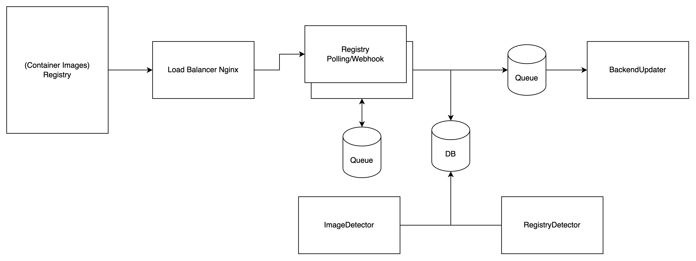

#  RoboBos - AutoImageUpdater

## Architecautre V1

# Milestone V1 

## Registry
### Webhook

- [x] Docker Hub
- [ ] ECR
- [ ] GCP - Artifact Registry
- [ ] Gitlab
- [ ] Github

### Polling
- [ ] Docker Hub
- [ ] ECR
- [ ] GCP - Artifact Registry
- [ ] Gitlab
- [ ] Github

### BackendUpdater
- [ ] Ability to Git.
- [ ] Ability to updating with yamlpath.

## Milestone V2
## Notifcation
- [ ] Slack

